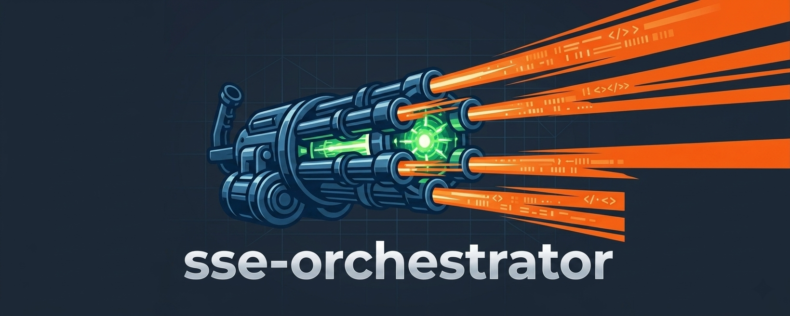
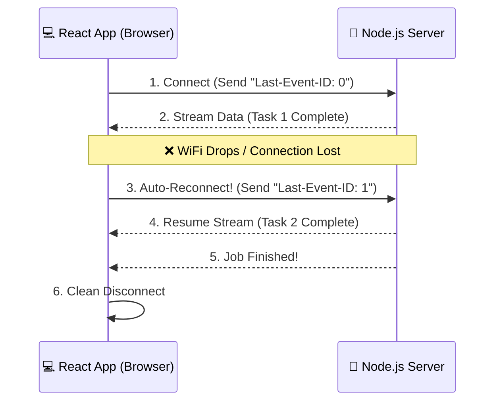

<div align="center">



*A resilient, ultra-lightweight, type-safe server sent events orchestrator.*

[](https://www.npmjs.com/package/sse-orchestrator) [](https://opensource.org/licenses/MIT)

</div>

---

## Features

- **Auto-reconnection**: Automatically reconnects when the connection is interrupted.
- **State recovery**: Uses `Last-Event-ID` to resume streams from the last successful event.
- **Type-safe**: Fully written in TypeScript with generic event payload support.
- **Zero dependencies**: Lightweight and browser-friendly.
- **Framework agnostic**: Works with React, Vue, Svelte, Angular, or plain JavaScript.
- **Custom headers support**: Send authentication tokens and custom request headers.
- **Event-driven API**: Subscribe to typed events with a simple API.

## Installation

```bash
npm install sse-orchestrator
```

---

## Why State Recovery Matters

Traditional SSE clients reconnect automatically but often lose workflow progress after a network interruption.

`sse-orchestrator` sends the last successfully processed event ID using the `Last-Event-ID` header during reconnection. This allows your server to resume the stream exactly where it stopped instead of restarting the entire process.

This is especially useful for:

- AI response streaming
- File processing pipelines
- Video transcoding jobs
- Report generation
- Long-running background tasks
- Real-time workflow systems

---

## How State Recovery Works

Instead of complex architectures, `sse-orchestrator` relies on a simple ping-pong of IDs between the browser and your server to ensure no data is lost.



**What happens under the hood:**
1. The client connects and tracks the ID of every incoming message.
2. If the connection suddenly drops, the client catches the error.
3. It immediately fires a new connection, attaching the last known ID to the HTTP headers.
4. Your server reads that ID and skips directly to the uncompleted tasks.

---

## Local Development

To run the included full-stack example:

1. Clone the repository.

```bash
git clone https://github.com/talha5978/sse-orchestrator.git
```

2. Install dependencies.

```bash
npm install
```

3. Build the package.

```bash
npm run build
```

4. Run mock servers & clients

```bash
// mock servers
node example/llm-chat-stream/server.ts
node example/task-automation-pipeline/server.ts

// mock clients
npx tsx example/llm-chat-stream/client.ts
npx tsx example/task-automation-pipeline/client.ts

// mock app
cd example/react-router/app/
npm run dev
```

---

## Use Cases

- AI streaming applications
- Chat applications
- Background job monitoring
- Real-time dashboards
- Workflow orchestration systems
- File upload processing
- Data import/export tracking
- Event-driven applications

