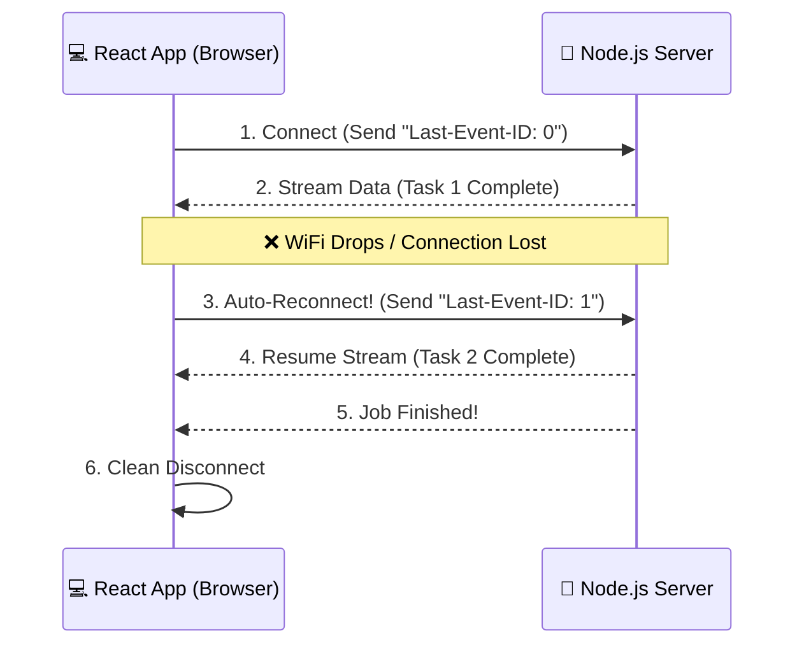

<div align="center">


*A resilient, ultra-lightweight, type-safe server-sent events orchestrator.*

[](https://www.npmjs.com/package/sse-orchestrator) [](https://opensource.org/licenses/MIT)

</div>

---

## Features

- **Auto-reconnection**: Automatically reconnects when the connection is interrupted with backoff/jitter strategies.
- **State recovery**: Uses `Last-Event-ID` to resume streams seamlessly from the exact point of failure.
- **Type-safe**: Built from the ground up in TypeScript with generic event payload support and automatic type-narrowing.
- **Global Middleware Engine**: Intercept, mutate, or intercept event streams sequentially before downstream execution.
- **Zero dependencies**: Lightweight, efficient, and browser-friendly.
- **Framework agnostic**: Works natively with React, Vue, Svelte, Angular, or plain JavaScript.
- **Custom headers support**: Send authentication tokens and custom request headers dynamically.

## Installation

```bash
npm install sse-orchestrator
```

---

## Why State Recovery Matters

Traditional SSE clients reconnect automatically but often lose workflow progress after a network interruption.

`sse-orchestrator` sends the last successfully processed event ID using the `Last-Event-ID` header during reconnection. This allows your server to resume the stream exactly where it stopped instead of restarting the entire intensive process.

This is especially useful for:

- AI response token streaming
- File processing pipelines
- Video transcoding jobs
- Long-running background database tasks
- Real-time workflow automation systems

---

## How State Recovery Works

Instead of complex synchronization architectures, `sse-orchestrator` relies on a simple ping-pong of identifiers between the client application and your upstream server.



**What happens under the hood:**
1. The client connects and tracks the ID of every incoming structured message block.
2. If the connection suddenly drops, the client catches the connection error.
3. It immediately fires an internal reconnection process, attaching the last known ID to the HTTP headers.
4. Your server reads that ID and skips directly forward to the uncompleted tasks.

---

## Global Middleware Pipeline

`sse-orchestrator` includes a powerful, type-safe middleware engine that allows you to intercept, mutate, or drop incoming Server-Sent Events before they ever reach your standard `.on()` event listeners. This is perfect for data parsing, logging, global sanitization, or telemetry collection.

### 1. Vanilla TypeScript Usage

The `.use()` method supports functional method chaining (the builder pattern). You can register multiple middleware layers sequentially. To surgically remove a middleware from the execution stack later, use `.ejectMiddleware()`.

```typescript
import { SSEOrchestrator, type SSEMiddleware } from "sse-orchestrator";

interface AIEvents {
    token: { text: string };
    done: { totalTokens: number };
}

const orchestrator = new SSEOrchestrator<AIEvents>({ url: "/api/stream" });

// Define a reusable, type-safe middleware function
const appendNewline: SSEMiddleware<AIEvents> = (event) => {
    // 💡 TypeScript magic: Checking event.type automatically narrows event.data!
    if (event.type === "token") {
        event.data.text += "\n"; 
    }
    return event;
};

// Chain middleware registrations seamlessly
orchestrator
    .use(appendNewline)
    .use((event) => {
        console.log(`[Middleware Log] Processing event: ${event.type}`);
        return event; // Always return the mutated context
    });
```

### 2. React Framework Integration

When developing inside functional React components, registering middleware loosely inside the component body will trigger **re-render duplication bugs**. To prevent this, use the built-in `useSSEMiddleware` hook, which safely isolates the subscription footprint using stable references under the hood.

```tsx
import React from "react";
import { useSSEOrchestrator, useSSEMiddleware } from "sse-orchestrator";

interface PipelineEvents {
    step_progress: { name: string };
}

export function PipelineDashboard() {
    const { orchestrator, status } = useSSEOrchestrator<PipelineEvents>({
        url: "http://localhost:4001",
        method: "GET",
    });

    // ✅ Safe across infinite component re-renders. Zero-churn design.
    useSSEMiddleware(orchestrator, (event) => {
        if (event.type === "step_progress") {
            event.data.name += " (Verified)";
        }
        return event;
    });

    return <div>Connection Status: {status}</div>;
}
```

### 3. Canceling/Dropping Events

Middleware execution works sequentially. If any middleware layer returns `null` or `false`, the orchestration pipeline immediately aborts execution, drops the payload, and protects downstream `.on()` listeners from ever firing.

```typescript
orchestrator.use((event) => {
    if (event.type === "token" && !event.data.text) {
        return null; // ❌ Drops empty tokens completely from the pipeline stream
    }
    return event; // ✅ Allows valid payloads to progress forward
});
```

---

## API Documentation

This guide details the core API of the `SSEOrchestrator` class and the utilities provided by the React hooks package.

### 1. `SSEOrchestrator` (Core Library)

The `SSEOrchestrator` manages the lifecycle of the Fetch-based stream connection, handles advanced reconnection strategies, and provides a type-safe event-driven interface.

#### Public API Reference

| Method | Signature / Params | Description |
| :--- | :--- | :--- |
| `connect()` | `() => void` | Initiates the HTTP stream request. Automatically handles reconnection pipelines if the stream is interrupted. |
| `disconnect()` | `() => void` | Aborts the active fetch request and cleans up all event listeners. Essential for preventing memory leaks. |
| `on()` | `(event: K, callback: (data: T[K]) => void) => () => void` | Registers a listener for a specific event type. Returns an unsubscribe function. |
| `use()` | `(middleware: SSEMiddleware<T>) => this` | Registers a global middleware interceptor. Supports fluent method chaining. |
| `ejectMiddleware()` | `(middleware: SSEMiddleware<T>) => void` | Surgically removes a specific middleware instance from the execution stack. |
| `onStatusChange()` | `(callback: (status: ConnectionStatus) => void) => () => void` | Registers a global listener for connection status transitions. |
| `getStatus()` | `() => ConnectionStatus` | Returns the current connection status synchronously. |

---

### 2. React Hooks API

The React hooks abstraction removes the need for manual lifecycle management, allowing you to focus on building UI.

#### `useSSEOrchestrator<T>`

This hook manages a stable `SSEOrchestrator` instance and exposes its connection state to your components.

##### Parameters
* `config: SSEOrchestratorConfig` — Configuration object containing `url`, `method`, and optional `headers`.

##### Returns
* `orchestrator: SSEOrchestrator<T>` — A stable orchestrator reference that persists across re-renders.
* `status: ConnectionStatus` — A reactive state string representing the current connection loop.

#### `useSSEEvent<T, K>`

Registers an event listener and binds it cleanly to the component lifecycle.

##### Parameters
* `orchestrator: SSEOrchestrator<T>` — The instance returned by `useSSEOrchestrator`.
* `eventName: K` — The specific event key to subscribe to.
* `callback: (payload: T[K]) => void` — Function executed when the event is received. Protected against stale closures via internal refs.

#### `useSSEMiddleware<T>`

Safely hooks a global middleware interceptor directly into the React execution loop without incurring data pollution or multi-stacking bugs.

##### Parameters
* `orchestrator: SSEOrchestrator<T>` — The instance returned by `useSSEOrchestrator`.
* `middleware: SSEMiddleware<T>` — The interceptor logic to append to the parsing pipeline.

---

### 3. Server SDK (`SSEServerStream`)

The `/server` entrypoint provides a lightweight wrapper around Node.js network primitives. It handles type-safe event dispatching, automatic compression buffer flushing, and cross-case state recovery parsing out of the box.

#### Quick Start (Express Example)

```typescript
import express from "express";
import { SSEServerStream } from "sse-orchestrator/server";

const app = express();

interface MyEvents {
    step_progress: { progress: number; task: string };
    job_completed: { durationMs: number };
}

app.get("/stream", (req, res) => {
    // 1. Initialize the type-safe stream wrapper
    const stream = new SSEServerStream<MyEvents>(req, res, { allowOrigin: "*" });

    // 2. Read the client's recovery position seamlessly
    const lastId = stream.lastEventId ? parseInt(stream.lastEventId, 10) : 0;
    console.log(`Resuming stream from index: ${lastId}`);

    // 3. Dispatch type-safe continuous updates
    stream.send({
        event: "step_progress",
        data: { progress: 50, task: "Processing buffers" },
        id: "1"
    });

    // 4. Terminate cleanly with optional terminal payloads
    stream.end({
        event: "job_completed",
        data: { durationMs: 1200 },
        id: "2"
    });
});
```

#### Public API Reference

##### Properties & Methods

| Feature | Type / Signature | Description |
| :--- | :--- | :--- |
| `lastEventId` | `string \| null` | Contains the identifier extracted automatically from incoming `Last-Event-ID` request headers. |
| `send()` | `(config: { event: K; data: T[K]; id?: string \| number }) => void` | Serializes payloads directly into standard wire formats and flushes downstream compression pipes instantly. |
| `end()` | `(finalEvent?: { event: K; data: T[K]; id?: string \| number }) => void` | Transmits an optional final event block and gracefully commands the native HTTP socket pipeline to terminate. |

---

## Local Development

To run the included full-stack examples:

1. Clone the repository.
```bash
git clone [https://github.com/talha5978/sse-orchestrator.git](https://github.com/talha5978/sse-orchestrator.git)
cd sse-orchestrator
```

2. Install dependencies & build the binary.
```bash
npm install
npm run build
```

3. Run mock servers & clients.
```bash
// mock servers
node example/llm-chat-stream/server2.ts
node example/task-automation-pipeline/server2.ts

// mock clients
npx tsx example/llm-chat-stream/client.ts
npx tsx example/task-automation-pipeline/client.ts

// mock react app
cd example/react-router/app/
npm run dev
```

---

## Implementation Comparison

### Manual Implementation (Imperative)

Requires explicit lifecycle management, connection setup, and cleanup.

```typescript
useEffect(() => {
  const orchestrator = new SSEOrchestrator({...});
  orchestrator.on("event", (data) => { /* handle */ });
  orchestrator.connect();

  return () => {
    orchestrator.disconnect();
  };
}, []);
```

### Hooks Implementation (Declarative)

Provides a cleaner and more maintainable API with minimal boilerplate.

```typescript
const { orchestrator, status } = useSSEOrchestrator<PipelineEvents>({
    url: "http://localhost:4001/stream",
    method: "GET",
});

useSSEEvent(orchestrator, "job_started", (data) => {
  // Handle event
});
```

---

## License

Distributed under the MIT License. See `LICENSE` for more information.