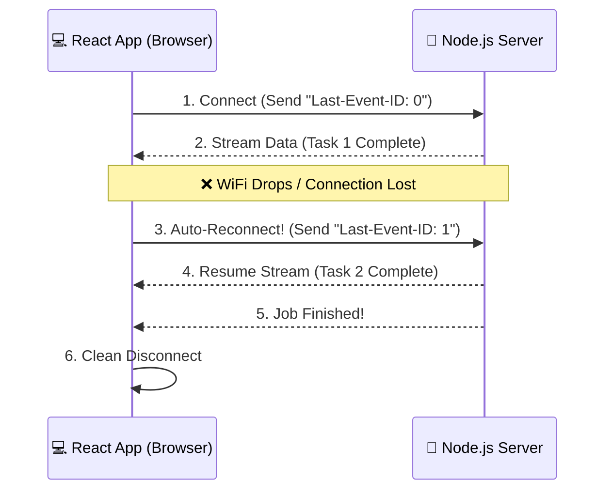

<div align="center">


*A resilient, ultra-lightweight, type-safe server sent events orchestrator.*

[](https://www.npmjs.com/package/sse-orchestrator) [](https://opensource.org/licenses/MIT)

</div>

---

## Features

- **Auto-reconnection**: Automatically reconnects when the connection is interrupted.
- **State recovery**: Uses `Last-Event-ID` to resume streams from the last successful event.
- **Type-safe**: Fully written in TypeScript with generic event payload support.
- **Zero dependencies**: Lightweight and browser-friendly.
- **Framework agnostic**: Works with React, Vue, Svelte, Angular, or plain JavaScript.
- **Custom headers support**: Send authentication tokens and custom request headers.
- **Event-driven API**: Subscribe to typed events with a simple API.

## Installation

```bash
npm install sse-orchestrator
```

---

## Why State Recovery Matters

Traditional SSE clients reconnect automatically but often lose workflow progress after a network interruption.

`sse-orchestrator` sends the last successfully processed event ID using the `Last-Event-ID` header during reconnection. This allows your server to resume the stream exactly where it stopped instead of restarting the entire process.

This is especially useful for:

- AI response streaming
- File processing pipelines
- Video transcoding jobs
- Report generation
- Long-running background tasks
- Real-time workflow systems

---

## How State Recovery Works

Instead of complex architectures, `sse-orchestrator` relies on a simple ping-pong of IDs between the browser and your server to ensure no data is lost.



**What happens under the hood:**
1. The client connects and tracks the ID of every incoming message.
2. If the connection suddenly drops, the client catches the error.
3. It immediately fires a new connection, attaching the last known ID to the HTTP headers.
4. Your server reads that ID and skips directly to the uncompleted tasks.

---

## Local Development

To run the included full-stack example:

1. Clone the repository.

```bash
git clone https://github.com/talha5978/sse-orchestrator.git
```

2. Install dependencies.

```bash
npm install
```

3. Build the package.

```bash
npm run build
```

4. Run mock servers & clients

```bash
// mock servers
node example/llm-chat-stream/server.ts
node example/task-automation-pipeline/server.ts

// mock clients
npx tsx example/llm-chat-stream/client.ts
npx tsx example/task-automation-pipeline/client.ts

// mock app
cd example/react-router/app/
npm run dev
```

---

## API Documentation

This guide details the core API of the `SSEOrchestrator` class and the utility provided by the React hooks package.

### 1. `SSEOrchestrator` (Core Library)

The SSEOrchestrator is the heart of the library. It manages the lifecycle of the Fetch-based stream connection, handles advanced reconnection strategies (backoff/jitter), and provides a type-safe event-driven interface.

#### Public API Reference

| Method                     | Description                                                                                                                          |
| -------------------------- | ------------------------------------------------------------------------------------------------------------------------------------ |
| `connect()`                | Initiates the HTTP stream request. Automatically handles reconnection pipelines if the stream is interrupted.           |
| `disconnect()`             | Aborts the active fetch request and cleans up all event listeners. Essential for preventing memory leaks on component unmount. |
| `on(event, callback)`      | Registers a listener for a specific event type. Returns an unsubscribe function that removes the listener.                           |
| `onStatusChange(callback)` | Registers a global listener for connection status changes (e.g., CONNECTED, DISCONNECTED, RETRYING).                    |
| `getStatus()`              | Returns the current connection status synchronously.                                                                                 |

> **TypeScript Tip**
>
>When using TypeScript, provide your event schema as a generic type: `new SSEOrchestrator<MyEvents>({...})`. This ensures full autocompletion for event names and payloads.

### 2. React Hooks API

The React hooks abstraction removes the need for manual `useEffect` lifecycle management, allowing you to focus on building UI.

#### `useSSEOrchestrator<T>`

This hook manages a stable `SSEOrchestrator` instance and exposes its connection state to your components.

##### Parameters

| Parameter | Type                    | Description                                                              |
| --------- | ----------------------- | ------------------------------------------------------------------------ |
| `config`  | `SSEOrchestratorConfig` | Configuration object containing `url`, `method`, and optional `headers`. |

##### Returns

| Property       | Type                 | Description                                                     |
| -------------- | -------------------- | --------------------------------------------------------------- |
| `orchestrator` | `SSEOrchestrator<T>` | A stable orchestrator instance that persists across re-renders. |
| `status`       | `ConnectionStatus`   | A reactive string representing the current connection state.    |

##### Why use it?

**Stable Instance**

Initializes the orchestrator once using `useRef`, ensuring that event listeners and orchestrator configuration are not recreated during normal component re-renders.

**Lifecycle Management**

Automatically calls:

* `connect()` when the component mounts.
* `disconnect()` when the component unmounts.

**Strict Mode Safe**

Integrates cleanly with React's lifecycle and cleanup patterns, ensuring that network streams are properly closed during unmounts and preventing duplicate parallel connections in React Strict Mode.

#### `useSSEEvent<T, K>`

This hook registers an event listener and binds it to the component lifecycle.

##### Parameters

| Parameter      | Type                      | Description                                    |
| -------------- | ------------------------- | ---------------------------------------------- |
| `orchestrator` | `SSEOrchestrator<T>`      | The instance returned by `useSSEOrchestrator`. |
| `eventName`    | `K`                       | The specific event key to subscribe to.        |
| `callback`     | `(payload: T[K]) => void` | Function executed when the event is received.  |

##### Why use it?

**Auto Cleanup**

Uses the unsubscribe function returned by the orchestrator to automatically remove event listeners when the component unmounts.

**Stale Closure Protection**

Stores the callback in a `useRef`, ensuring that if the component re-renders and the callback changes, the latest callback logic is executed without requiring a new event subscription.

This avoids unnecessary subscribe/unsubscribe cycles while keeping event handlers up to date.

### 3. Server SDK (`SSEServerStream`)

The `/server` entrypoint provides a lightweight, framework-agnostic wrapper around Node.js network primitives. It handles type-safe event dispatching, automatic compression buffer flushing, and cross-case state recovery parsing out of the box.

Because it operates directly on native `IncomingMessage` and `ServerResponse` interfaces, it integrates seamlessly into native HTTP servers, Express, Fastify, and more without complex adapters.

#### Quick Start (Express Example)

```typescript
import express from "express";
import { SSEServerStream } from "sse-orchestrator/server";

const app = express();

interface MyEvents {
    step_progress: { progress: number; task: string };
    job_completed: { durationMs: number };
}

app.get("/stream", (req, res) => {
    // 1. Initialize the type-safe stream wrapper
    const stream = new SSEServerStream<MyEvents>(req, res, { allowOrigin: "*" });

    // 2. Read the client's recovery position seamlessly
    const lastId = stream.lastEventId ? parseInt(stream.lastEventId, 10) : 0;
    console.log(`Resuming stream from index: ${lastId}`);

    // 3. Dispatch type-safe continuous updates
    stream.send({
        event: "step_progress",
        data: { progress: 50, task: "Processing buffers" },
        id: "1"
    });

    // 4. Terminate cleanly with optional terminal payloads
    stream.end({
        event: "job_completed",
        data: { durationMs: 1200 },
        id: "2"
    });
});
```

#### Public API Reference

##### Constructor Configuration

```typescript
new SSEServerStream(req, res, options?);
```

| Option | Type | Description |
| :--- | :--- | :--- |
| `allowOrigin` | `string` | Fallback Access-Control-Allow-Origin token string (Defaults to `*`). Ignored if host application router headers are pre-configured. |
| `customHeaders` | `Record<string, string>` | Custom key-value dictionary to append to the initial wire sequence handshake. |

##### Properties & Methods

| Feature | Type / Signature | Description |
| :--- | :--- | :--- |
| `lastEventId` | `string \| null` | Contains the string identifier extracted automatically from incoming `last-event-id` or `Last-Event-ID` request headers. |
| `send()` | `(config: { event: K; data: T[K]; id?: string \| number }) => void` | Serializes payloads directly into strict standard wire formats and flushes downstream compression pipes instantly. |
| `end()` | `(finalEvent?: { event: K; data: T[K]; id?: string \| number }) => void` | Transmits an optional final event block and gracefully commands the native HTTP socket pipeline to terminate. |

> **Framework Polyfills & Interceptors**
> 
> `SSEServerStream` includes native compatibility guards for third-party optimization tools. If your runtime uses Express compression middleware, the engine automatically catches the interceptor `.flush()` hook to enforce real-time block deliveries down the wire without buffering stalls.

### Bonus: Update Your `Local Development` Code Snippet

```bash
// mock servers
node example/llm-chat-stream/server2.ts
node example/task-automation-pipeline/server2.ts
```

---

## Implementation Comparison

### Manual Implementation (Imperative)

Requires explicit lifecycle management, connection setup, and cleanup.

```typescript
useEffect(() => {
  const orchestrator = new SSEOrchestrator({...});

  orchestrator.onStatusChange((nextStatus) => {
    // handle status change
  });

  orchestrator.on("event", (data) => {
    // handle event
  });

  orchestrator.connect();

  return () => {
    orchestrator.disconnect();
  };
}, []);
```

### Hooks Implementation (Declarative)

Provides a cleaner and more maintainable API with minimal boilerplate.

```typescript
const { orchestrator, status } =
  useSSEOrchestrator<PipelineEvents>({
    url: "http://localhost:4001/stream",
    method: "GET",
  });

useSSEEvent(orchestrator, "job_started", (data) => {
  // Handle event
});
```

### Benefits of the Hooks Approach

* Less boilerplate code.
* Automatic lifecycle management.
* Easier to read and maintain.
* Type-safe event subscriptions.
* Better React integration.
* Prevents common SSE cleanup mistakes.

## Recommended Usage

For React applications, prefer using:

* `useSSEOrchestrator`
* `useSSEEvent`

These hooks provide the best developer experience while automatically managing connection and subscription lifecycles.

Use the core `SSEOrchestrator` directly when:

* Working outside React.
* Building framework-agnostic libraries.
* Creating custom abstractions on top of the orchestrator.
* Integrating with Vue, Svelte, Angular, or vanilla JavaScript applications.

---

## Use Cases

- AI streaming applications
- Chat applications
- Background job monitoring
- Real-time dashboards
- Workflow orchestration systems
- File upload processing
- Data import/export tracking
- Event-driven applications

